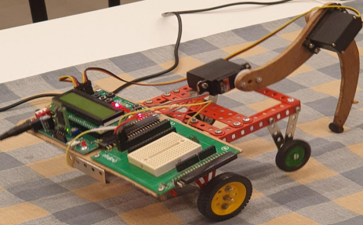
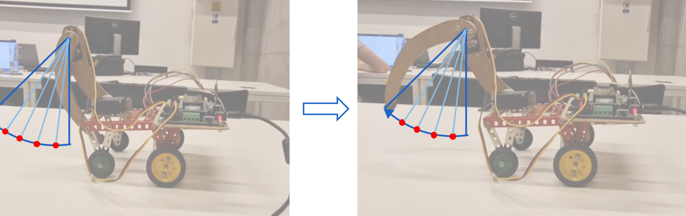
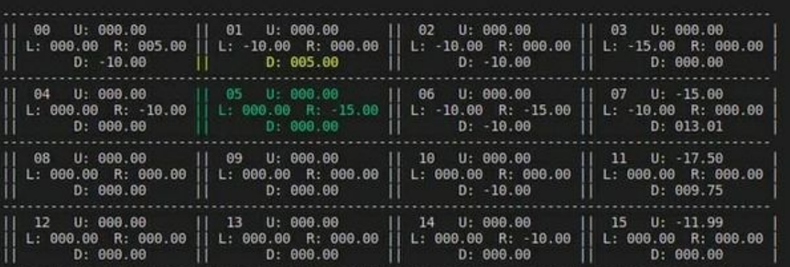

# Self-learning crawling robot: embedded Q-learning agent

## 1. Project summary

This is a PoC for deploying reinforcement learning (Q learning) on a constrained system.  
The goal was to program an AVR microcontroller in C to enable a two-servo robot to autonomously learn the optimal sequence of actions to crawl forward, using an angle encoder for real-time performance feedback.

Key achievement: successful implementation of the Q-learning algorithm (Bellman equation, ϵ-greedy policy) and a custom reward system entirely in resource-limited embedded C.

---

## 2. Features

### Embedded ML and algorithm
* Algorithm: Q-learning 
* Target system: AVR microcontroller 
* State space: 16 discrete states (4×4 Q-table)  
* Learning rate (α): 0.5 (experimentally derived)  
* Discount factor (γ): 0.99 (long-term policy coherence)  
* Exploration policy: ϵ-greedy with ϵ = 0.1–0.3, preceded by 100–150 random exploration steps  

### Hardware control and low-level C
* Actuator control: servomotors driven by fast PWM (Timer/Counter 1)  
* Movement refinement: implemented 10° interpolation steps to ensure mechanical stability and reduce vibration  
* Sensor input: angle encoder monitored asynchronously via external interrupt (INT0)  
* Debugging expertise: resolved register-level hardware conflict (D-register / USB pin PD5) to ensure reliable sensor reading

### Monitoring and visualization

* Two-way Bluetooth communication with a custom serial protocol  
* Data out: streams live Q-table values and reward history  
* Control in: allows manual control (pause/resume algorithm) from a host PC  
* Analysis: Python scripts plot reward history, showing convergence from random noise to consistent positive reward spikes  

---

## 3. Reward system design

The reward function was tuned to guide the learning process effectively:

* Forward movement: highly positive reward  
* Standing still or backward movement: negative penalty to push the agent out of unproductive local optima  

